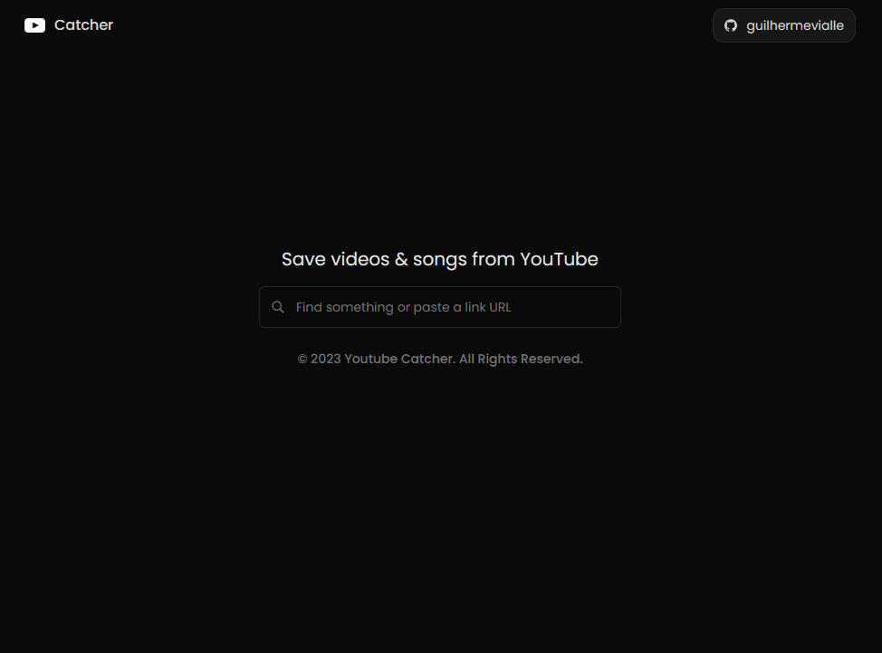

# Youtube Catcher

Download your favorite music or videos from youtube via link or video name and export in different quality formats.
Explore [here](https://ytcatcher.vercel.app/).

## Features

- Fast and Easy Download: Download YouTube videos quickly with just a few clicks.

- Responsive Design: UniSaver's interface is responsive and adapts seamlessly to different devices, including computers, tablets, and smartphones.

- Secure and Safe: We prioritize the security of your data and ensure that all personal information is protected.

- Completely Free: UniSaver is a free application with no hidden costs or subscriptions.

## Preview

## Technologies Used

- **Next.js**
- **React.js**
- **Jotai**
- **Tailwind CSS**
- **Axios**
- **Node.js**
- **Express**
- **REST**

## Contributing

Contributions to UniSaver are welcome! If you find any bugs, issues, or have suggestions for improvement, please open an issue on the project's GitHub repository. If you would like to contribute code, feel free to open a pull request.
